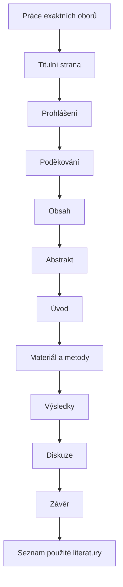

# Práce exaktních oborů

## Cíl

Uvidíte skladbu původní práce exaktních oborů jako svislý postup od titulní strany po seznam literatury.

Práce exaktních oborů stojí na vlastním výzkumu, měření nebo experimentu. Čtenář musí pochopit, co bylo zkoumáno, jak byl postup proveden a jak výsledky souvisejí s publikovanými poznatky.

## Poznámky ke skladbě

**Materiál a metody** mají umožnit zopakování nebo posouzení výzkumu. **Výsledky** uvádějí zjištění bez dojmů a emocí. **Diskuze** výsledky vysvětluje, hodnotí a porovnává s jinými pracemi.

!!! warning "Ověřte s vedoucím práce"
    Konkrétní názvy metodických a výsledkových kapitol se mohou lišit podle oboru a zadání.

## Kontrolní bod

- [ ] Je jasné, jak byl výzkum proveden.
- [ ] Výsledky nejsou smíchané s osobním hodnocením.
- [ ] Diskuze porovnává výsledky s relevantní literaturou.

## Související témata

- [Obrázky a grafy](../google-docs/obrazky-a-grafy.md)
- [Citace autor-rok](../zotero/citace-autor-rok.md)

