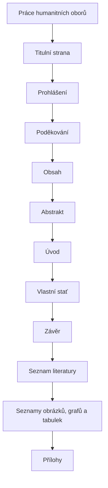

# Práce humanitních oborů

## Cíl

Uvidíte skladbu původní humanitně orientované práce jako svislý postup od titulní strany po přílohy.

Humanitní práce má sledovat jasnou argumentační linku. Vlastní stať se dělí do věcných kapitol podle tématu, pramenů, postupu a argumentace.

!!! info "Požadavek GASOŠ"
    Kapitoly nemají nést jen obecné názvy „Teoretická část“ a „Praktická část“. Název kapitoly má odpovídat skutečnému obsahu.

## Poznámky ke skladbě

Seznamy obrázků, grafů a tabulek se zařazují jen tehdy, když je práce skutečně potřebuje. Přílohy patří za hlavní text a závěrečné seznamy.

!!! warning "Ověřte s vedoucím práce"
    U pramenně založených prací si ověřte podobu archivních citací a vhodný citační styl.

## Kontrolní bod

- [ ] Vlastní stať má věcné názvy kapitol.
- [ ] Argumentace postupuje srozumitelně od otázky k závěru.
- [ ] Seznamy a přílohy jsou zařazeny jen tehdy, když jsou potřeba.

## Související témata

- [Citace v poznámkách](../zotero/citace-v-poznamkach.md)
- [Archivní prameny](../zotero/archivni-prameny.md)

