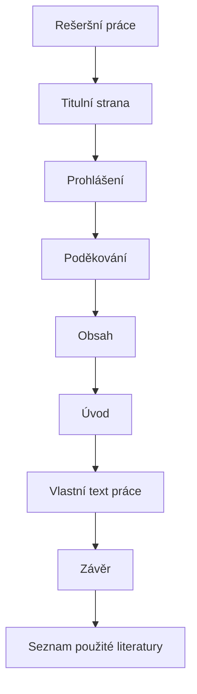

# Rešeršní práce

Rešeršní neboli kompilační práce je podle školního manuálu přípustná jen výjimečně. Musí pracovat s větším množstvím relevantních zdrojů a autor v ní zdroje porovnává, propojuje a parafrázuje.

!!! info "Požadavek GASOŠ"
    Práce nesmí být pouhým opisem nebo skládáním citátů. Převzaté myšlenky musí být přeformulované a citované.

## Poznámky ke skladbě

Poděkování není obsahově povinné. Úvod vymezuje téma, aktuální stav problematiky a cíle práce. Vlastní text má být vystavěný věcně, ne jako sled opsaných pasáží.

## Kontrolní bod

- [ ] Vlastní kapitoly odpovídají tématu, ne obecnému dělení na teorii a praxi.
- [ ] Každá převzatá myšlenka má citaci.
- [ ] Seznam použité literatury navazuje na skutečně použité zdroje.

## Související témata

- [Přidávání zdrojů](../zotero/pridavani-zdroju.md)
- [Seznam použité literatury](../zotero/seznam-literatury.md)
