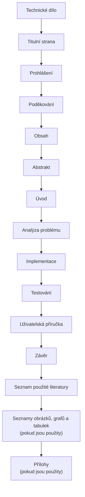

# Technické dílo

Technické dílo popisuje problém, zvolené řešení, implementaci a ověření funkčnosti. Důležité je vysvětlit rozhodnutí a doložit, že výsledné řešení funguje.

## Poznámky ke skladbě

**Analýza problému** rozkládá úlohu, porovnává existující řešení a zdůvodňuje zvolený postup. **Implementace** popisuje vytvořené řešení, ale nemusí obsahovat celý zdrojový kód. **Testování** ukazuje, jak byla ověřena funkčnost. Seznamy obrázků, grafů a tabulek i přílohy se zařazují jen tehdy, když je práce skutečně obsahuje.

!!! tip "Doporučený postup"
    Pokud je uživatelská příručka dlouhá, může být vhodnější umístit ji do příloh a v hlavním textu popsat jen její účel.

## Kontrolní bod

- [ ] Čtenář chápe problém, který práce řeší.
- [ ] Implementace popisuje důležitá rozhodnutí, ne jen výpis kódu.
- [ ] Testování dokládá funkčnost řešení.

## Související témata

- [Obrázky a grafy](../google-docs/obrazky-a-grafy.md)
- [Export do PDF](../dokonceni/export-pdf.md)
