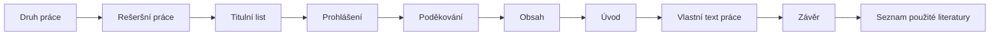

# Jak připravit maturitní práci v Google Docs a Zoteru

## Obsahový základ krokového manuálu pro studenty GASOŠ

> Tento soubor je obsahovým „masterem“ budoucí webové publikace. Obsahuje konkrétní postupy a rozhodnutí ověřená při praktickém nastavování cvičného dokumentu. Při převodu do MkDocs se má rozdělit do kratších stránek podle `STRUKTURA_OBSAHU.md`, nikoliv znovu obsahově domýšlet.

**Primární školní podklad:** Manuál GASOŠ `gasos-manual-jak_napsat_MP-240221.pdf`, verze 240221.  
**Prostředí nácviku:** Google Docs v českém rozhraní, Zotero Desktop a Zotero Connector.  
**Určení:** maturitní, ročníkové a seminární odborné práce.  

---

# 1. Jak s manuálem pracovat

Tento manuál je navržen především pro společnou práci ve třídě. Učitel promítá jednotlivé kroky a studenti je současně provádějí ve vlastním cvičném dokumentu.

U každé větší části je vhodné postupovat takto:

1. učitel ukáže výsledek;
2. stručně vysvětlí, proč se dané nastavení používá;
3. studenti provedou kroky;
4. všichni společně zkontrolují výsledek;
5. teprve potom se pokračuje další částí.

V textu je nutné rozlišovat:

- **Požadavek GASOŠ** – pravidlo vycházející ze školního manuálu nebo šablony;
- **Doporučený postup** – způsob, jak požadavku bezpečně dosáhnout v Google Docs nebo Zoteru;
- **Technické omezení** – vlastnost aplikace, kterou nelze běžným nastavením změnit;
- **Ověřit s vedoucím** – věc závislá na oboru, zvolené normě nebo konkrétním zadání.

Názvy položek nabídek se mohou po aktualizaci Google Docs nebo Zotera mírně změnit. Princip postupu zůstává stejný.

---

# 2. Nejdříve zvolte druh práce

Podle manuálu GASOŠ nestačí rozdělit práci pouze na „teoretickou“ a „praktickou“ část. Takové obecné členění není přípustné. Struktura musí odpovídat skutečnému typu práce a použité metodě.

## 2.1 Rešeršní (kompilační) práce

Pořadí základních částí:

1. Titulní list
2. Prohlášení
3. Poděkování
4. Obsah
5. Úvod
6. Vlastní text práce
7. Závěr
8. Seznam použité literatury

Kompilační práce je podle školního manuálu přípustná jen výjimečně. Musí vycházet z vyšších desítek relevantních, převážně knižních nebo časopiseckých zdrojů. Vlastní text není pouhým opisem nebo skládáním citátů. Autor zdroje porovnává, propojuje a přeformulovává a každou převzatou myšlenku řádně cituje.



## 2.2 Původní práce exaktních oborů

Pořadí základních částí:

1. Titulní list
2. Prohlášení
3. Poděkování
4. Obsah
5. Abstrakt
6. Úvod
7. Materiál a metody
8. Výsledky
9. Diskuze
10. Závěr
11. Seznam použité literatury

Kapitola **Materiál a metody** musí umožnit čtenáři pochopit, jak byl výzkum proveden. **Výsledky** předkládají zjištění bez dojmů a emocí. V **Diskuzi** se výsledky vysvětlují, hodnotí a porovnávají s publikovanými pracemi.

```mermaid
flowchart LR
    D["Druh práce"] --> R["Původní exaktní práce"]
    R --> A["Titulní list"] --> B["Prohlášení"] --> C["Poděkování"] --> E["Obsah"]
    E --> F["Abstrakt"] --> G["Úvod"] --> H["Materiál a metody"] --> I["Výsledky"]
    I --> J["Diskuze"] --> K["Závěr"] --> L["Seznam použité literatury"]
```



## 2.3 Původní práce humanitních oborů

Pořadí základních částí:

1. Titulní list
2. Prohlášení
3. Poděkování
4. Obsah
5. Abstrakt
6. Úvod
7. Vlastní stať rozdělená do věcných kapitol
8. Závěr
9. Seznam literatury
10. Seznamy obrázků, grafů a tabulek, pokud jsou potřebné
11. Přílohy, pokud jsou potřebné

Vlastní stať má sledovat jasnou argumentační linku. Autor popisuje badatelský postup, pracuje s prameny, shromažďuje a porovnává výsledky a hledá mezi nimi souvislosti. Kapitoly mají nést názvy podle skutečného tématu, nikoliv obecné názvy „Teoretická část“ a „Praktická část“.

```mermaid
flowchart LR
    D["Druh práce"] --> R["Původní humanitní práce"]
    R --> A["Titulní list"] --> B["Prohlášení"] --> C["Poděkování"] --> E["Obsah"]
    E --> F["Abstrakt"] --> G["Úvod"] --> H["Vlastní stať"] --> I["Závěr"]
    I --> J["Seznam literatury"] --> K["Seznamy obrazových prvků"] --> L["Přílohy"]
```



## 2.4 Technické dílo

Pořadí základních částí:

1. Titulní strana
2. Prohlášení
3. Poděkování
4. Obsah
5. Abstrakt
6. Úvod
7. Analýza problému
8. Implementace
9. Testování
10. Uživatelská příručka
11. Závěr
12. Seznam použité literatury

Analýza problému rozkládá úlohu, porovnává existující řešení a zdůvodňuje zvolený postup. Implementace popisuje vytvořené řešení; není nutné vkládat celý zdrojový kód. Testování vysvětluje, jak byla ověřena funkčnost. Dlouhou uživatelskou příručku lze umístit do příloh.

```mermaid
flowchart LR
    D["Druh práce"] --> R["Technické dílo"]
    R --> A["Titulní strana"] --> B["Prohlášení"] --> C["Poděkování"] --> E["Obsah"]
    E --> F["Abstrakt"] --> G["Úvod"] --> H["Analýza problému"] --> I["Implementace"]
    I --> J["Testování"] --> K["Uživatelská příručka"] --> L["Závěr"] --> M["Seznam použité literatury"]
```



> Poděkování není obsahově povinné. Seznamy obrazových prvků a přílohy se zařazují pouze tehdy, když je práce skutečně obsahuje.

---

# 3. Připravte si nástroje

## 3.1 Google Docs

Pro nácvik je vhodné založit nový dokument nebo vytvořit kopii školní šablony. Pokud škola poskytuje závaznou šablonu, má přednost před obecným postupem v této příručce.

Doporučený postup:

1. Otevřete Google Disk.
2. Vytvořte nový Dokument Google nebo kopii školní šablony.
3. Soubor ihned smysluplně pojmenujte.
4. Ověřte, že jste jeho vlastníkem nebo máte právo upravovat dokument i připojený skript.
5. Před rozsáhlým automatickým zásahem vytvořte pojmenovanou verzi nebo kopii dokumentu.

Historie verzí je základní bezpečnostní síť. Na Macu vrací poslední běžnou úpravu zkratka **Cmd+Z**. Krok znovu provede **Cmd+Shift+Z**. Automatický skript však může provést mnoho změn najednou, proto je před jeho prvním spuštěním vhodnější kopie nebo pojmenovaná verze.

## 3.2 Zotero

Pro plnohodnotnou práci potřebujete:

1. **Zotero Desktop** – hlavní aplikaci a bibliografickou knihovnu;
2. **Zotero Connector** – rozšíření prohlížeče;
3. volitelně bezplatný účet na Zotero.org pro synchronizaci;
4. Google Docs nebo Word.

Webová knihovna Zotera umožňuje zdroje prohlížet, upravovat a sdílet, ale nenahrazuje desktopovou aplikaci. Pro vkládání a úpravu citací v Google Docs musí být Zotero Desktop nainstalované a spuštěné.

---

# 4. Začněte neformátovaným cvičným textem

Při společném nácviku je vhodné začít textem, který obsahuje záměrné chyby. Studenti se tak neučí jen klikat na nabídky, ale rozpoznávat rozdíl mezi strukturou a vzhledem.

Cvičný dokument má obsahovat:

- titulní stranu;
- alespoň tři úrovně nadpisů;
- několik běžných odstavců;
- odrážkový a číslovaný seznam;
- tabulku;
- obrázek a graf;
- dvě citace;
- nadbytečné mezery a prázdné odstavce;
- ručně napsaná čísla nadpisů, která se později odstraní;
- ručně vytvořené mezery, které se nahradí nastavením odstavce.

Příklad tématu použitého při nácviku:

> **Vliv používání chytrých telefonů na soustředění studentů**

Ukázkové části:

- 2.2 Využívání chytrých telefonů ve škole
- 2.2.1 Způsoby využití telefonu
- 3 Metodika výzkumu
- 3.1 Výzkumný soubor
- 3.2 Průběh měření
- 5 Diskuze

Příklad běžného odstavce:

> Výzkumu se zúčastnilo 48 studentů druhého ročníku střední školy. Studenti byli rozděleni do dvou stejně velkých skupin. První skupina měla během výuky telefony uložené v taškách. Druhá skupina je mohla ponechat na lavici, ale nebyla vyzvána k jejich používání.

Příklad textu pro odrážkový seznam:

> Mezi nejčastější způsoby využití telefonu při výuce patří vyhledávání informací souvisejících s probíraným tématem, komunikace prostřednictvím sociálních sítí, fotografování poznámek nebo zadání, poslech hudby a hraní her.

---

# 5. Nastavte stránku

## 5.1 Formát a okraje

**Požadavek GASOŠ:** A4 a všechny okraje 2,5 cm.

Postup v Google Docs:

1. Otevřete **Soubor → Vzhled stránky**.
2. Pokud dokument používá režim bez stránek, přepněte jej na **Stránky**.
3. Zvolte formát papíru **A4**.
4. Nastavte horní, dolní, levý a pravý okraj na **2,5 cm**.
5. Ponechte orientaci **Na výšku**, pokud konkrétní příloha nevyžaduje jinak.
6. Potvrďte změny.

### Kontrola

- Dokument je zobrazen jako samostatné stránky.
- Všechny okraje mají 2,5 cm.
- Tabulky ani obrázky nepřesahují do okrajů.

## 5.2 Zobrazte netisknutelné znaky

Při formátování zapněte **Zobrazit → Zobrazit netisknutelné znaky**. Uvidíte:

- konce odstavců;
- mezery;
- tabulátory;
- konce stránek;
- konce oddílů.

Tato kontrola odhalí většinu problémů s „nevysvětlitelnými“ mezerami. Značky se netisknou a v exportovaném PDF nebudou vidět.

---

# 6. Nastavte běžný text pomocí stylu

Ruční změna písma jednoho odstavce není nastavení dokumentu. Základní vzhled je třeba uložit do stylu **Normální text**.

## 6.1 Povinné parametry běžného textu

**Požadavek GASOŠ:**

- patkové písmo;
- velikost 12 bodů;
- zarovnání do bloku;
- řádkování 1,5;
- mezera za odstavcem 6 bodů;
- bez odsazení prvního řádku.

Konkrétní rodinu písma zvolte podle školní šablony. Typickým příkladem patkového písma je Times New Roman, ale název písma nesmí být vydáván za školní povinnost, pokud jej šablona neurčuje.

## 6.2 Nastavení stylu Normální text

1. Označte jeden běžný odstavec.
2. Nastavte patkové písmo a velikost **12 bodů**.
3. Nastavte **zarovnání do bloku**.
4. Otevřete **Formát → Řádkování a mezery mezi odstavci**.
5. Nastavte řádkování **1,5**.
6. Nastavte mezeru za odstavcem na **6 bodů**; podle verze rozhraní použijte vlastní mezery odstavce.
7. V nastavení odsazení ověřte, že první řádek není odsazen.
8. V nabídce stylů otevřete **Normální text** a zvolte **Aktualizovat Normální text podle výběru**.

Od této chvíle nevytvářejte běžný text ručním kopírováním vzhledu. Nové odstavce označujte stylem **Normální text**.

### Důležité vyjasnění

Pod číslovaným nadpisem například `2.2.1 Způsoby využití telefonu` následuje běžný odstavec ve stylu **Normální text**. Neodsazuje se tabulátorem tak, aby začínal pod textem nadpisu nebo pod číslem `2.2.1`. Číslo je součástí struktury nadpisu, nikoliv okrajem pro následující text.

## 6.3 Odstraňte falešné mezery

Při zobrazených netisknutelných znacích zkontrolujte:

- mezi dvěma slovy je jen jedna mezera;
- prázdné místo mezi odstavci nevytvářejí opakované stisky Enter;
- zarovnání nevytvářejí řady mezer;
- nové stránky nevytvářejí desítky prázdných odstavců.

Mezery mezi odstavci řeší nastavení odstavce. Novou stránku řeší konec stránky. Změnu číslování nebo zápatí řeší konec oddílu.

---

# 7. Nastavte styly nadpisů

## 7.1 Hierarchie

**Požadavek GASOŠ:** nejvýše tři úrovně nadpisů.

- **Nadpis 1** – hlavní kapitola, například `3 Metodika výzkumu`;
- **Nadpis 2** – podkapitola, například `3.1 Výzkumný soubor`;
- **Nadpis 3** – nižší podkapitola, například `3.1.1 Výběr respondentů`.

Úroveň se nevybírá podle požadované velikosti písma. Vyjadřuje postavení kapitoly ve struktuře.

## 7.2 Vzhled nadpisů

**Požadavek GASOŠ:** bezpatkové, tučné písmo, nejvýše 16 bodů.

Doporučený postup pro každý styl:

1. Označte vzorový nadpis příslušné úrovně.
2. Nastavte bezpatkové písmo, tučné provedení a vhodnou velikost nejvýše 16 bodů.
3. Nastavte mezery před a za nadpisem pomocí formátu odstavce, nikoliv prázdnými řádky.
4. Zapněte **Udržet s dalším**.
5. Podle potřeby zapněte **Udržet řádky pohromadě**.
6. V nabídce stylu zvolte **Aktualizovat Nadpis 1/2/3 podle výběru**.

### Udržet s dalším není konec stránky

Volba **Udržet s dalším** zabrání, aby nadpis zůstal osamocený dole na stránce a odstavec začínal až na další stránce. Nevynucuje začátek kapitoly na nové stránce.

Konec stránky vložte pouze tehdy, když má kapitola podle struktury skutečně začít na nové stránce. Nedávejte konec stránky před každý nadpis jen proto, aby zůstal s textem.

---

# 8. Vytvořte víceúrovňové číslování nadpisů

Čísla nadpisů se nemají psát ručně. Ruční čísla se po vložení nebo přesunutí kapitoly sama neopraví a mohou poškodit automatický obsah.

Požadovaný výsledek:

```text
1 Název kapitoly
1.1 Název podkapitoly
1.1.1 Název nižší podkapitoly
2 Další kapitola
```

## 8.1 Příprava před automatizací

1. Odstraňte ručně napsaná čísla z nadpisů, pokud by je skript přidal znovu.
2. Každému nadpisu přiřaďte správný styl **Nadpis 1**, **Nadpis 2** nebo **Nadpis 3**.
3. Běžným odstavcům ponechte **Normální text**.
4. Vytvořte kopii dokumentu nebo pojmenovanou verzi.

## 8.2 Hromadné číslování

V našem postupu číslování zajišťuje vlastní Apps Script. Po vložení a autorizaci skriptu spusťte příkaz odpovídající aktualizaci číslování nadpisů. Skript musí:

- projít odstavce dokumentu;
- rozpoznat styly Nadpis 1–3;
- odstranit starou automatickou číselnou předponu;
- vypočítat správné číslo podle úrovně;
- přidat nové číslo bez změny samotného názvu kapitoly.

**Před zveřejněním příručky doplnit přesný název nabídky a tlačítka podle finálního skriptu.** Nepoužívat staré chybové verze kódu.

### Kontrola

- Nadpisy stejné úrovně mají stejný vzhled.
- Číslování plynule navazuje.
- Nadpis 2 vždy patří pod předchozí Nadpis 1.
- Nadpis 3 vždy patří pod předchozí Nadpis 2.
- V názvu není číslo dvakrát.
- Běžný text není součástí číslovaného seznamu.

---

# 9. Odrážkové a číslované seznamy

## 9.1 Kdy který seznam použít

- **Odrážkový seznam** použijte, pokud pořadí položek není podstatné.
- **Číslovaný seznam** použijte pro postup, pořadí, prioritu nebo počet kroků.

Seznam nevytvářejte ručním psaním znaků `-`, `•`, `1)` a mezer. Použijte skutečný seznam v Google Docs.

## 9.2 Vytvoření odrážkového seznamu

1. Každou budoucí položku napište do samostatného odstavce.
2. Označte všechny položky.
3. Klikněte na **Odrážkový seznam**.
4. Vyberte jednotný typ odrážky.
5. Pomocí pravítka nebo nastavení odsazení sjednoťte polohu odrážky a začátku textu.
6. Odstraňte prázdné položky, které vznikly nadbytečným Enterem.

## 9.3 Víceúrovňový seznam

- **Tab** nebo **Zvětšit odsazení** přesune položku na nižší úroveň.
- **Shift+Tab** nebo **Zmenšit odsazení** ji vrátí výše.
- Úroveň seznamu nepoužívejte jen jako grafické odsazení; musí vyjadřovat podřízenost položky.

## 9.4 Lze uložit styl seznamu?

Google Docs nemá plnohodnotný pojmenovaný styl seznamu jako Word. Praktický postup je:

1. vytvořit jeden vzorový seznam;
2. přesně nastavit odrážku, odsazení a mezery;
3. další seznam naformátovat pomocí kopírování formátu nebo podle vzoru;
4. pravidelně vizuálně kontrolovat jednotnost.

Nepoužívejte pro položky samostatné prázdné odstavce. V cvičném textu se takové prázdné položky objevily a po zapnutí netisknutelných znaků byly dobře viditelné.

---

# 10. Konce stránek a oddíly

## 10.1 Konec stránky

Konec stránky ukončí aktuální stránku a pokračuje na následující, ale nemění záhlaví, zápatí ani číslování.

Použijte jej například:

- za titulní stranou;
- mezi samostatnými úvodními částmi podle šablony;
- před seznamem použité literatury;
- před seznamem obrázků a grafů;
- před seznamem tabulek;
- před přílohami;
- před hlavní kapitolou, která má podle požadavků začínat na nové straně.

Postup: **Vložit → Konec → Konec stránky**. Podle rozhraní může být příkaz dostupný také přímo v nabídce **Vložit**.

## 10.2 Konec oddílu

Konec oddílu je ekvivalentem oddílu ve Wordu. Dokument rozdělí na části, které mohou mít odlišné:

- záhlaví a zápatí;
- zobrazování a průběh čísel stran;
- orientaci stránky;
- další nastavení oddílu.

Pokud vyberete **Konec oddílu – další stránka**, nový oddíl současně začne na nové straně. Při průběžném konci oddílu pokračuje nový oddíl na stejné stránce.

Když je v nabídce vidět pouze „konec sekce“, jde o totéž co konec oddílu; názvosloví se může lišit podle překladu rozhraní.

## 10.3 Co použít před nadpisem

- Chci pouze zabránit osamocenému nadpisu: **Udržet s dalším**.
- Chci vždy začít na nové stránce: **Konec stránky**.
- Chci začít na nové stránce a současně změnit zápatí nebo číslování: **Konec oddílu – další stránka**.

---

# 11. Titulní strana

Vždy vycházejte ze školní šablony. Titulní strana se počítá jako první stránka, ale číslo se na ní nezobrazuje.

Název práce může být vodorovně vycentrován a umístěn přibližně do optického středu stránky. Nevytvářejte jeho polohu dlouhou řadou prázdných odstavců. Takové rozložení se po změně písma nebo okrajů snadno rozpadne.

Stabilnější možnosti:

- použít hotovou školní titulní stránku;
- použít rozvržení převzaté ze školní šablony;
- případně použít neviditelnou tabulku nebo jiné stabilní řešení po dohodě se školou.

Za titulní stránku vložte skutečný konec stránky.

---

# 12. Tabulky

## 12.1 Umístění a popisek

**Požadavek GASOŠ:** Popisek tabulky je nad tabulkou a začíná `Tab. xx`.

Příklad:

> **Tab. 1: Průměrný počet kontrol telefonu během dvacetiminutové výukové aktivity podle sledované skupiny.**

Popisek musí být samovysvětlující. Čtenář má pochopit obsah tabulky bez dohledávání základního vysvětlení v okolním textu.

## 12.2 Vytvoření a formátování

1. Vložte tabulku přes **Vložit → Tabulka**.
2. První řádek použijte jako záhlaví, pokud tabulka obsahuje více řádků dat.
3. Vodorovné zarovnání nastavte běžnými tlačítky zarovnání textu.
4. Svislé zarovnání najdete po kliknutí pravým tlačítkem přes **Vlastnosti tabulky → Buňka → Svislé zarovnání**.
5. U čísel používejte konzistentní počet desetinných míst.
6. Nezahlcujte tabulku barvami a silným ohraničením.
7. Ověřte, že tabulka nepřesahuje do okrajů.

## 12.3 Udržení tabulky a popisku

- Na odstavec s popiskem nad tabulkou použijte **Udržet s dalším**.
- Na víceřádkový popisek použijte také **Udržet řádky pohromadě**.
- Zkontrolujte, zda se popisek neocitl sám dole na stránce.

Pokud tabulka používá převzatá data, uveďte zdroj i tehdy, když jste tabulku graficky vytvořili sami.

---

# 13. Obrázky a grafy

## 13.1 Umístění a popisek

**Požadavek GASOŠ:** Obrázky a grafy se označují společně jako `Obr. xx`. Popisek je pod obrazovým prvkem.

Příklady:

> **Obr. 1: Rozložení účastníků výzkumu podle sledované skupiny.**

> **Obr. 2: Průměrný počet správných odpovědí podle umístění mobilního telefonu. Vlastní zpracování.**

Graf nepoužívá samostatnou řadu „Graf 1“. Jeho číslo navazuje na obrázky a další obrazové prvky.

## 13.2 Samovysvětlující popisek

Popisek má podle potřeby obsahovat:

- co je zobrazeno;
- koho nebo čeho se data týkají;
- jednotku nebo časové období;
- vysvětlení méně známých zkratek;
- autora nebo zdroj;
- informaci „vlastní zpracování“, pokud ji vyžaduje zvolený způsob citování.

## 13.3 Udržení prvku s popiskem

Protože je popisek pod obrázkem nebo grafem:

1. umístěte obrázek nebo graf do samostatného odstavce;
2. na odstavec s obrazovým prvkem použijte **Udržet s dalším**;
3. na víceřádkový popisek použijte **Udržet řádky pohromadě**;
4. zkontrolujte výsledek při exportu do PDF.

## 13.4 Autorská práva

- U vlastního obrázku nebo grafu uveďte autorství podle školních pravidel.
- U reprodukce uveďte původní zdroj.
- U internetových obrázků používejte licenci, která užití dovoluje, například odpovídající licenci Creative Commons.
- Odkazujte na stránku s informací o autorovi a licenci, nikoliv jen na přímou adresu souboru obrázku.
- Pokud licence použití nedovoluje, je nutné získat souhlas autora nebo držitele práv.

---

# 14. Automatické popisky a seznamy obrazových prvků

Google Docs nemá stejně robustní systém automatických titulků a seznamů obrázků jako Word. V našem řešení tuto mezeru vyplňuje vlastní Apps Script. Samostatný „caption maker“ plugin proto není nutný.

## 14.1 Očekávaný pracovní postup

1. Vložte tabulku, obrázek nebo graf na správné místo.
2. Vytvořte popisek na samostatném řádku.
3. Použijte přesný typ označení očekávaný skriptem:
   - `Tab.` pro tabulky;
   - `Obr.` pro obrázky a grafy.
4. Nepište čísla ručně, pokud je doplňuje skript.
5. Spusťte aktualizaci popisků.
6. Spusťte aktualizaci seznamů nebo společný příkaz „Aktualizovat vše“.
7. Zkontrolujte návaznost čísel a funkčnost odkazů.

**Před zveřejněním doplnit přesnou syntaxi vstupního popisku a názvy příkazů podle finálního skriptu.**

## 14.2 Vzhled automatických seznamů

- Nadpis seznamu může používat odpovídající nadpisový styl, aby se zobrazil v obsahu.
- Jednotlivé položky seznamu mají používat běžné černé písmo bez nechtěného tučného zvýraznění.
- Položky není nutné držet s následujícím odstavcem, pokud k tomu není zvláštní důvod.
- Seznam obrázků a grafů, seznam tabulek a případně seznam příloh mají začínat na samostatných stránkách.

## 14.3 Skript je součástí dokumentu

Apps Script otevřený z daného Google dokumentu je kontejnerově vázaný k tomuto dokumentu. Při vytvoření kopie dokumentu se má zkontrolovat, zda se zkopíroval i skript a zda nový uživatel udělil potřebná oprávnění. Instalovatelné spouštěče a uživatelská autorizace se běžně musí řešit pro každého uživatele zvlášť.

---

# 15. Automatický obsah

Obsah se nikdy nevypisuje ručně. Vzniká ze stylů nadpisů.

Postup:

1. Ověřte, že všechny kapitoly používají styly Nadpis 1–3.
2. Umístěte kurzor na stránku určenou pro obsah.
3. Zvolte **Vložit → Obsah**.
4. Vyberte variantu s čísly stran nebo odkazy podle školní šablony.
5. Po změnách klikněte do obsahu a použijte ikonu aktualizace.

### Kontrola

- V obsahu nejsou běžné odstavce.
- Nechybí žádná hlavní kapitola.
- Úrovně jsou správně odsazené.
- Čísla a názvy odpovídají dokumentu.
- Odkazy vedou na správné nadpisy.

Nadpis **Seznam použité literatury** se obvykle nečísluje, ale má být v obsahu. V Google Docs je proto potřeba ověřit souhru nadpisového stylu, automatického číslování a vlastního skriptu. Tento bod musí být otestován ve finální šabloně.

---

# 16. Číslování stran

**Požadavek GASOŠ:** Strany se počítají od titulní strany jako od strany 1, ale číslo se zobrazí až na první stránce za obsahem.

## 16.1 Princip

Dokument rozdělte na nejméně dva oddíly:

- přední část: titulní list, prohlášení, poděkování a obsah – čísla nejsou vidět;
- hlavní text od první strany za obsahem – čísla se zobrazují.

## 16.2 Postup

1. Umístěte kurzor na konec obsahu.
2. Vložte **Konec oddílu – další stránka**.
3. Na první stránce hlavního textu otevřete zápatí.
4. Vypněte **Propojit s předchozím**, aby se zápatí druhého oddílu mohlo lišit.
5. Zvolte **Vložit → Čísla stránek → Další možnosti** nebo odpovídající nabídku.
6. Použijte nastavení jen na aktuální oddíl.
7. Nastavte správnou počáteční hodnotu. Pokud je první stránka hlavního textu fyzicky šestou stránkou dokumentu, má zobrazit číslo 6.
8. Ověřte, že se číslo nezobrazuje v přední části.

### Kontrola

- Titulní strana nemá viditelné číslo.
- Prohlášení, poděkování a obsah nemají viditelné číslo.
- První stránka za obsahem má správné skutečné číslo, nikoliv automaticky 1.
- Čísla dále plynule navazují.

---

# 17. Které části mají začínat na samostatné stránce

Pro přehlednost a stabilní sazbu použijte skutečné konce stránek, nikoliv prázdné odstavce.

Na samostatné stránce má zpravidla začínat:

- titulní list;
- prohlášení;
- poděkování, pokud je použito;
- obsah;
- hlavní text za obsahem;
- seznam použité literatury;
- seznam obrázků a grafů;
- seznam tabulek;
- přílohy.

Za závěr tedy vložte konec stránky před seznam literatury. Za seznam literatury vložte další konec stránky před následující seznam. Totéž opakujte mezi dalšími samostatnými seznamy a přílohami.

Konec stránky nevkládejte všude, kde jen chcete udržet nadpis s textem. K tomu slouží **Udržet s dalším**.

---

# 18. Instalace a základní nastavení Zotera

## 18.1 Instalace

1. Stáhněte a nainstalujte Zotero Desktop z oficiálního webu.
2. Nainstalujte Zotero Connector do používaného prohlížeče. V Safari je Connector součástí desktopové instalace a aktivuje se v nastavení rozšíření Safari.
3. Spusťte Zotero Desktop.
4. Otevřete Google Docs a ověřte, že se objevila nabídka **Zotero**.
5. Při prvním použití povolte propojení s dokumentem.

Pokud se nabídka nezobrazí, nejprve restartujte Zotero a prohlížeč a zkontrolujte Connector.

## 18.2 Účet a synchronizace

Zotero je zdarma. Bezplatný účet na Zotero.org není nutný pro samotné lokální citování, ale doporučuje se kvůli synchronizaci bibliografických údajů a práci na více počítačích.

Rozlišujte:

- synchronizaci bibliografických záznamů;
- synchronizaci příloh a PDF, která může využívat omezenou kapacitu nebo jiné úložiště.

Pro jednu maturitní práci si vytvořte samostatnou sbírku. Položka může být ve více sbírkách, aniž by se duplikovala.

---

# 19. Přidávání zdrojů do Zotera

## 19.1 Connector – doporučený způsob

1. Otevřete primární stránku článku, knihy nebo záznam v kvalitním katalogu.
2. Klikněte na ikonu Zotero Connectoru.
3. Vyberte cílovou sbírku.
4. Po uložení otevřete záznam v Zoteru a zkontrolujte metadata.

Ukládání z primární stránky je obvykle spolehlivější než ukládání samotného PDF.

## 19.2 Přidání podle identifikátoru

V Zoteru použijte ikonu kouzelné hůlky **Přidat položku podle identifikátoru**. Podporované identifikátory zahrnují:

- **ISBN** – kniha nebo konkrétní knižní vydání;
- **DOI** – digitální identifikátor článku nebo jiného odborného výstupu;
- **PMID** – záznam v PubMedu;
- **arXiv ID** – preprint v arXivu;
- **ADS Bibcode** – především astronomie a fyzika.

### ISSN

ISSN označuje časopis nebo seriál jako celek, nikoliv konkrétní článek. Dialog identifikátoru jej nepoužije k nalezení konkrétního článku. Článek přidejte přes Connector, DOI, databázový export nebo ručně. ISSN pak může být uložen jako metadata časopisu.

## 19.3 Import RIS nebo BibTeX

Soubory `.ris` a `.bib` se neimportují přímo do citační nabídky ve Wordu nebo Google Docs. Nejprve je importujte do knihovny Zotera:

1. stáhněte RIS nebo BibTeX ze stránky databáze či katalogu;
2. v Zotero Desktop zvolte **Soubor → Importovat**;
3. vyberte soubor;
4. zkontrolujte vytvořené záznamy;
5. teprve potom je citujte v dokumentu.

## 19.4 PDF

PDF lze přetáhnout do Zotera. Zotero se pokusí získat metadata a vytvořit nadřazený bibliografický záznam. U skenů nebo nekvalitních souborů nemusí být rozpoznání úspěšné. Samostatné PDF bez nadřazeného záznamu není připraveno pro správné citování.

## 19.5 Ruční záznam

Ruční zadání použijte, když zdroj nemá použitelnou webovou stránku, identifikátor ani kvalitní katalogový záznam. Vždy vyberte správný typ položky, protože podle něj Zotero nabízí pole a sestavuje citaci.

---

# 20. Zkontrolujte metadata dříve, než začnete citovat

Automaticky získaná data nejsou automaticky správná. U každého zdroje zkontrolujte:

- typ položky;
- autora nebo autory;
- správné rozdělení jména a příjmení;
- název;
- rok nebo úplné datum;
- název časopisu, knihy nebo webu;
- nakladatele a místo vydání, pokud je styl vyžaduje;
- ročník, číslo a rozsah stran;
- DOI, ISBN, ISSN nebo URL;
- jazyk;
- datum přístupu u online zdroje, pokud je vyžadováno.

Chybu neopravujte přepsáním hotové citace v Google Docs. Opravte záznam v knihovně Zotera a v dokumentu použijte **Zotero → Refresh**.

---

# 21. Zvolte jeden citační systém

Manuál GASOŠ připouští tři systémy:

1. průběžné citace v poznámkách pod čarou;
2. číselné citace;
3. systém jména a roku, tedy Harvard.

Pro maturitní práce školní manuál doporučuje systém autor–rok. V humanitních pracích mohou být vhodné poznámky pod čarou. Vždy se používá právě jeden systém v celé práci a tomu musí odpovídat i seznam literatury.

Styl dokumentu změníte přes **Zotero → Document Preferences**. Zotero dokáže existující dynamické citace a bibliografii přeformátovat. Citace proto nepřepisujte ručně.

---

# 22. Citace autor–rok podle ISO 690

Pro nácvik použijte styl:

> `ISO-690 (author-date, Čeština)`

## 22.1 Vložení citace

1. Umístěte kurzor přímo na místo, kde má být odkaz.
2. Zvolte **Zotero → Add/Edit Citation**.
3. Začněte psát jméno autora, název nebo rok.
4. Vyberte správný zdroj.
5. Potvrďte citaci.

Výsledek může vypadat například:

> Opakované přepínání mezi výukovou činností a telefonem může zvyšovat čas potřebný k dokončení úkolu (Ward et al., 2017).

Konkrétní interpunkce a podoba `et al.` nebo `a kol.` závisí na vybraném CSL stylu. V dokumentu se používá jednotně.

## 22.2 Citace se jménem autora ve větě

Jméno lze uvést přímo ve větě:

> Ward a kol. (2017) popisují souvislost mezi přítomností telefonu a dostupnou kognitivní kapacitou.

V citačním dialogu je možné podle stylu potlačit opakované jméno autora, aby se ve větě neobjevilo dvakrát. Postup musí být ověřen v používané verzi Zotera.

## 22.3 Číslo stránky

U přímé citace a u přesného odkazu na pasáž doplňte stránku:

1. otevřete **Add/Edit Citation**;
2. klikněte na bublinu vybraného zdroje;
3. zvolte lokátor **Strana**;
4. napište číslo nebo rozsah stran;
5. potvrďte.

Stránku nepište ručně vedle dynamické citace, pokud ji lze zadat jako lokátor.

## 22.4 Umístění citace vůči tečce

Školní manuál rozlišuje rozsah odkazu:

- citace před tečkou se vztahuje k dané větě;
- citace za tečkou se podle školního výkladu vztahuje k textu od začátku odstavce do tohoto místa.

Student musí umístit citaci tak, aby bylo jednoznačné, které převzaté tvrzení podporuje. Dlouhé odstavce s jedinou nejasnou citací na konci jsou rizikové.

---

# 23. Citace v poznámkách pod čarou

Poznámkový systém je vhodný zejména pro některé humanitní práce. Pro praktický test fungoval styl:

> `ISO-690 (full note, Čeština)`

## 23.1 Přepnutí existujícího dokumentu

1. Otevřete **Zotero → Document Preferences**.
2. Místo autor–rok vyberte `ISO-690 (full note, Čeština)`.
3. Potvrďte změnu.
4. Zotero převede dynamické citace na poznámky pod čarou.
5. Zkontrolujte první a opakované citování stejného zdroje.

## 23.2 Vložení nové poznámkové citace

1. Napište tvrzení a koncové interpunkční znaménko.
2. Umístěte kurzor za znaménko, pokud se odkaz vztahuje k celé větě.
3. Nevkládejte předem ruční poznámku pod čarou.
4. Zvolte **Zotero → Add/Edit Citation**.
5. Vyberte zdroj a případně stránku.
6. Zotero samo vytvoří horní index i text poznámky.

Správné typografické umístění při odkazu na celou větu:

> …současně zvyšovat počet chyb.¹

Pokud je již autor–rok citace skutečným polem Zotera, nepřepisujte ji ručně. Změňte styl celého dokumentu.

## 23.3 Soulad s manuálem GASOŠ

Školní manuál popisuje v poznámce zkrácenou citaci obsahující autora, název, rok a stránku a úplný záznam v seznamu literatury. Bezprostředně opakovaný zdroj může používat „Tamtéž“.

Název stylu `full note` naznačuje plnou poznámkovou citaci, proto je před finálním doporučením nutné ověřit:

- podobu první citace;
- podobu další citace stejného zdroje;
- práci s konkrétní stránkou;
- zda výsledný seznam literatury odpovídá školnímu požadavku.

Pokud styl neodpovídá požadované zkrácené podobě, je třeba vybrat vhodnější CSL styl nebo školní styl upravit. Varianta `ISO-690 (note, without bibliography, Čeština)` není vhodná, pokud má Zotero vytvářet závěrečný seznam literatury.

---

# 24. APA 7 a číselný systém

## 24.1 APA 7

APA 7 funguje v Zoteru technicky obdobně:

1. vyberte **American Psychological Association 7th edition** v Document Preferences;
2. vložte citace přes Add/Edit Citation;
3. doplňte stránky jako lokátory;
4. vložte bibliografii přes Add/Edit Bibliography.

APA 7 je systém autor–rok. Bibliografie je abecední a nečíslovaná. Výstup APA není totožný s ISO 690; dva styly se v jedné práci nemíchají.

## 24.2 Číselný systém

V číselném systému dostává zdroj číslo podle pravidel zvoleného stylu. Při opakovaném odkazu na tentýž zdroj se používá stejné číslo. Bibliografie je číslovaná a zpravidla uspořádaná podle prvního výskytu zdrojů v textu, nikoliv abecedně.

Čísla citací ani bibliografie se nepíší ručně. Vytváří je Zotero.

## 24.3 Rychlé srovnání

| Systém | Odkaz v textu | Závěrečný seznam |
|---|---|---|
| ISO 690 autor–rok | autor a rok v textu nebo závorce | abecední, nečíslovaný |
| APA 7 | autor a rok | abecední, nečíslovaný |
| Poznámky pod čarou | horní index a poznámka | abecední, zpravidla nečíslovaný |
| Číselný systém | číslo zdroje | číslovaný podle pravidel stylu |

---

# 25. Archivní prameny v Zoteru

Archiválie obvykle nepoužívají ISBN, PMID, arXiv ID ani ADS Bibcode. DOI mohou mít některá digitalizovaná data nebo publikace, ale není to obecné pravidlo pro archivní dokument.

Běžná archivní identifikace může obsahovat:

- název archivu;
- fond nebo sbírku;
- číslo nebo značku fondu;
- inventární číslo;
- signaturu;
- karton nebo krabici;
- složku;
- folio nebo stranu;
- datum dokumentu.

Příklad struktury odkazu:

> Název archivu, název fondu, inventární číslo, signatura, karton, folio.

Postup v Zoteru:

1. Klikněte na **Nová položka (+)**.
2. Podle povahy pramene vyberte například **Rukopis**, **Dopis** nebo **Dokument**.
3. Vyplňte autora, název nebo stručný popis, datum a archivní údaje.
4. Přidejte trvalý odkaz, pokud existuje digitalizovaná verze.
5. Vložte citaci do zkušebního dokumentu.
6. Zkontrolujte výsledek podle školních nebo oborových pravidel.

Běžný styl ISO 690 nemusí všechny archivní údaje sestavit ideálně. Pro humanitní práce může být nutný upravený CSL styl nebo ruční doplnění podle závazné metodiky. Ruční úprava se má dělat až promyšleně, aby se neztratila možnost automatické aktualizace.

---

# 26. Přímá citace, parafráze a plagiát

## 26.1 Přímá citace

Přímá citace:

- přebírá text doslovně;
- zachovává význam i potřebné typografické prvky;
- je zřetelně označena uvozovkami nebo blokovou citací;
- uvádí autora a zdroj;
- má obsahovat konkrétní stránku, pokud ji zdroj má.

Podle manuálu GASOŠ nemají přímé citace v humanitní práci přesáhnout 10 % textu. V původních pracích exaktních oborů se přímé citace podle manuálu nepoužívají.

## 26.2 Parafráze

Parafráze:

- vyjadřuje převzatou myšlenku vlastními slovy;
- nemění původní význam;
- není v uvozovkách;
- vždy uvádí zdroj;
- nevzniká pouhou záměnou několika slov za synonyma.

## 26.3 Co citovat

Citujte převzatý:

- text;
- názor nebo myšlenku;
- výsledek výzkumu;
- data;
- obrázek;
- graf;
- tabulku;
- část vlastní dříve publikované práce.

Obecně známé skutečnosti citaci obvykle nevyžadují. Pokud však převezmete doslovnou formulaci obecně známého faktu, citovat ji musíte.

Vyhýbejte se citování „z druhé ruky“. Pokud je původní dílo běžně dostupné, dohledávejte a citujte původní zdroj.

---

# 27. Automatický seznam použité literatury

## 27.1 Vložení

1. Za závěr vložte konec stránky.
2. Napište nadpis **Seznam použité literatury**.
3. Použijte odpovídající nadpisový styl, ale ověřte, zda má být nadpis číslovaný.
4. Stiskněte Enter a nový odstavec nastavte na **Normální text**.
5. Umístěte do něj kurzor.
6. Zvolte **Zotero → Add/Edit Bibliography**.

Zotero vloží zdroje, které jsou v dokumentu skutečně citované. Nevkládá automaticky celou osobní knihovnu.

## 27.2 Aktualizace

- Po přidání nebo odebrání citace zvolte **Zotero → Refresh**.
- Chybný údaj opravte v Zotero Desktop a potom dokument obnovte.
- Automatický seznam nepřepisujte ručně.
- Příkaz **Unlink Citations** odstraňuje propojení nevratně; použijte jej nanejvýš v konečné kopii dokumentu, pokud je to skutečně nutné.

## 27.3 Má být seznam číslovaný?

- ISO 690 autor–rok: nečíslovaný a abecední.
- APA 7: nečíslovaný a abecední.
- ISO 690 full note: standardně nečíslovaný a abecední; školní manuál u poznámkového systému připouští číslovanou i nečíslovanou variantu.
- Číselný citační systém: číslovaný podle pořadí daného stylem.

Čísla do bibliografie nepřidávejte ručně jen proto, že seznam „vypadá jako seznam“.

---

# 28. Apps Script – instalace a bezpečné používání

## 28.1 Vložení skriptu

1. Otevřete cvičný Google dokument.
2. Otevřete **Rozšíření → Apps Script**.
3. Vložte pouze finální, otestovaný kód.
4. Uložte projekt.
5. Obnovte dokument, pokud skript vytváří vlastní nabídku pomocí `onOpen()`.
6. Při prvním spuštění potvrďte požadovaná oprávnění.

Skript spuštěný z editoru nemusí mít stejné možnosti pro uživatelské dialogy jako příkaz spuštěný z nabídky dokumentu. Finální návod má proto vést studenty přes vlastní nabídku v Google Docs, pokud ji skript poskytuje.

## 28.2 Doporučený provozní postup

1. Dokončete styly nadpisů a popisků.
2. Vytvořte pojmenovanou verzi dokumentu.
3. Spusťte společný příkaz aktualizace.
4. Zkontrolujte číslování nadpisů.
5. Zkontrolujte `Tab.` a `Obr.`.
6. Zkontrolujte seznamy a odkazy.
7. Aktualizujte automatický obsah.
8. Aktualizujte Zotero citace a bibliografii.

## 28.3 Historie opravených chyb

Při vývoji se objevily tyto chyby:

- `TypeError: DocumentApp.flush is not a function` – služba `DocumentApp` nemá tuto metodu;
- `TypeError: doc.getUi is not a function` – uživatelské rozhraní se nezískává z objektu dokumentu tímto způsobem;
- `Exception: Invalid argument: element` – při vytváření záložky byl předán nepřípustný typ prvku nebo pozice.

Tyto zprávy patří do kapitoly řešení problémů, nikoliv do veřejně nabízeného zdrojového kódu. Finální `.gs` soubor musí být převzat z aktuální fungující verze.

---

# 29. Závěrečná kontrola dokumentu

Před exportem proveďte kontrolu v tomto pořadí.

## 29.1 Struktura

- [ ] Práce odpovídá zvolenému typu.
- [ ] Není obecně rozdělena jen na teoretickou a praktickou část.
- [ ] Nechybí povinné úvodní a závěrečné části.
- [ ] Nadpisy mají nejvýše tři úrovně.

## 29.2 Styly a odstavce

- [ ] Běžný text používá styl Normální text.
- [ ] Nadpisy používají Nadpis 1–3.
- [ ] Text není zarovnáván opakovanými mezerami.
- [ ] Mezi slovy je jedna mezera.
- [ ] Mezi odstavci nejsou prázdné řádky nahrazující mezeru 6 bodů.
- [ ] Běžný text má patkové písmo 12 bodů, blok, řádkování 1,5 a mezeru za odstavcem 6 bodů.

## 29.3 Stránky a zalomení

- [ ] Okraje jsou 2,5 cm a formát A4.
- [ ] Nadpisy nezůstávají samy dole na stránce.
- [ ] Nové stránky vytvářejí konce stránek, nikoliv prázdné odstavce.
- [ ] Oddíly jsou použity jen tam, kde se mění nastavení.
- [ ] Číslo se poprvé zobrazí až za obsahem a má správnou hodnotu.

## 29.4 Tabulky a obrazové prvky

- [ ] Každá tabulka má popisek `Tab.` nad tabulkou.
- [ ] Každý obrázek a graf má popisek `Obr.` pod prvkem.
- [ ] Obrázky a grafy používají společnou číselnou řadu.
- [ ] Popisky jsou samovysvětlující.
- [ ] Popisek zůstal s příslušným prvkem.
- [ ] Převzaté prvky a data mají zdroj a použitelné licenční oprávnění.
- [ ] Automatické seznamy jsou aktuální.

## 29.5 Citace

- [ ] Je použit jeden citační systém.
- [ ] Každá převzatá myšlenka má jednoznačný odkaz.
- [ ] Přímé citace mají stránky a správné označení.
- [ ] Metadata byla zkontrolována v Zoteru.
- [ ] Bibliografie byla aktualizována přes Refresh.
- [ ] V bibliografii nejsou ručně přidaná čísla odporující stylu.

## 29.6 Obsah a odkazy

- [ ] Automatický obsah je aktualizovaný.
- [ ] Nadpisy i čísla stran odpovídají dokumentu.
- [ ] Seznam literatury a další závěrečné seznamy jsou v obsahu podle školních pravidel.
- [ ] Odkazy vytvořené skriptem fungují.

---

# 30. Export do PDF nebo PDF/A

1. Vytvořte konečnou pojmenovanou verzi dokumentu.
2. Spusťte finální aktualizaci Apps Scriptu.
3. Aktualizujte obsah.
4. V Zoteru spusťte **Refresh**.
5. Zkontrolujte bibliografii.
6. Stáhněte dokument jako PDF.
7. Pokud škola vyžaduje nebo preferuje PDF/A, použijte ověřený postup převodu a výsledek validujte.
8. Otevřete stažené PDF mimo Google Docs.
9. Projděte každou stránku.

V PDF kontrolujte zejména:

- nechtěné prázdné stránky;
- osamocené nadpisy;
- rozdělené tabulky a popisky;
- kvalitu obrázků;
- přetečení tabulek;
- fonty a zvláštní znaky;
- čísla stran;
- obsah a seznamy;
- funkčnost odkazů, pokud mají být zachovány.

Samotný úspěšný export není důkazem správné sazby. Rozhodující je vizuální kontrola výsledného PDF.

---

# 31. Rychlé řešení problémů

## Nadpis zůstal na konci stránky

Zapněte u stylu nadpisu **Udržet s dalším**. Nevkládejte automaticky konec stránky.

## V textu jsou velké mezery nebo prázdná místa

Zapněte netisknutelné znaky. Odstraňte nadbytečné mezery a prázdné odstavce. Mezery řešte nastavením odstavce.

## Běžný text je odsazen pod číslo `1.1`

Odstraňte tabulátor nebo ruční odsazení a použijte styl **Normální text**.

## Konec oddílu nepřešel na další stránku

Byl pravděpodobně použit průběžný konec oddílu. Použijte variantu **další stránka** nebo za průběžný konec vložte konec stránky.

## Čísla nadpisů se neaktualizovala

Ověřte styly Nadpis 1–3, oprávnění skriptu, správný dokument a finální verzi kódu. Před dalším zásahem vytvořte kopii.

## Popisek se oddělil od tabulky

Na popisek nad tabulkou použijte **Udržet s dalším**.

## Popisek se oddělil od obrázku nebo grafu

Na odstavec obsahující obrazový prvek použijte **Udržet s dalším** a zkontrolujte export do PDF.

## Zotero se v Google Docs nezobrazuje

Zkontrolujte, zda je nainstalován Connector, spuštěno Zotero Desktop a povoleno rozšíření. Restartujte aplikaci i prohlížeč.

## Identifikátor ISSN nic nenašel

ISSN identifikuje časopis, nikoliv konkrétní článek. Použijte DOI článku, Connector, RIS/BibTeX nebo ruční záznam.

## Bibliografie není číslovaná

U autor–rok, APA 7 a full-note stylu je nečíslovaná bibliografie obvyklá. Číslovanou bibliografii vytváří číselný styl.

## Citace se po opravě zdroje nezměnila

Opravte data v Zotero Desktop a v Google Docs zvolte **Zotero → Refresh**.

## Citace v poznámce je před tečkou

Pokud se vztahuje k celé větě, odstraňte ji a vložte Zoterem znovu za koncové interpunkční znaménko. Nepřesouvejte nebo nepřepisujte samotný text dynamické citace ručně.

---

# 32. Body, které je nutné doplnit před zveřejněním

- Aktuální školní šablonu a přesný odkaz na ni.
- Finální fungující Apps Script.
- Přesné názvy příkazů vlastní nabídky skriptu.
- Přesnou vstupní syntaxi popisků pro skript.
- Ověření, zda se při kopírování školní šablony kopíruje bound script v zamýšleném distribučním postupu.
- Ověření nadpisu seznamu literatury: nečíslovaný, ale zahrnutý v automatickém obsahu.
- Ověření prvního a následného odkazu ve stylu `ISO-690 (full note, Čeština)` proti požadavku GASOŠ na zkrácenou poznámku.
- Aktuální snímky českého rozhraní Google Docs a Zotera.
- Aktuální organizační pokyny, termíny a pojmenování odevzdávaného souboru.
- Rozhodnutí, zda je veřejné zveřejnění školního manuálu dovoleno.

---

# 33. Doporučené rozdělení obsahu do webu

Při převodu do MkDocs rozdělte tento master soubor podle `STRUKTURA_OBSAHU.md`. Každá stránka má být krátká, zaměřená na jeden praktický úkol a použitelná samostatně.

Obsah se nemá mechanicky duplikovat. Společná pravidla se vysvětlí jednou a ostatní stránky na ně odkážou. Web musí zároveň nabídnout přímou výukovou cestu od založení dokumentu až po export do PDF.

